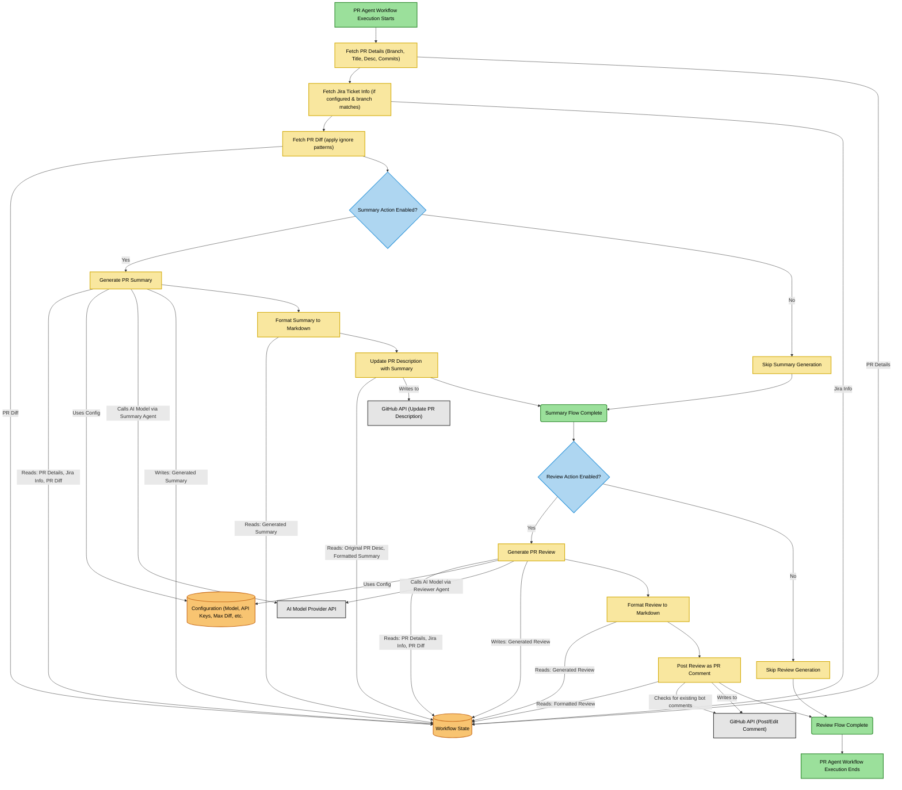

# PR Agent

 

A GitHub Action to automatically summarise and review Pull Requests, enhancing code quality and developer productivity.

## Features

*   **AI-Powered Summaries:** Generates concise, structured summaries of PR changes, including suggested titles, PR types, key changes, and file breakdowns.
*   **AI-Powered Reviews:** Provides automated code reviews, identifying potential issues (bugs, performance, security, readability), suggesting fixes, and assessing review effort.
*   **Multiple AI Providers:** Supports various AI models via configurable providers (OpenAI, Azure OpenAI, Anthropic, Google Gemini, OpenAI-Compatible endpoints).
*   **Jira Integration (Optional):** Extracts Jira ticket IDs from branch names (if configured) and fetches ticket summaries/descriptions to provide context to the AI agents.
*   **Configurable Actions:** Choose whether to run summaries, reviews, or both. Trigger actions on PR open or via specific comments (`/summary`, `/review`).
*   **Diff Filtering & Truncation:** Ignore specified file patterns (e.g., `package-lock.json`) and safely truncate large diffs to fit within model context limits.
*   **Workflow Orchestration:** Uses [Mastra](https://mastra.ai/) for defining and executing the review/summary workflow steps.
*   **Idempotent Updates:** Edits existing bot comments/summaries instead of posting duplicates on subsequent runs.

## How it Works

This project is implemented as a GitHub Action built with TypeScript and Node.js. It leverages the `@mastra/core` library to define a workflow (`prAgentWorkflow`) that orchestrates the following steps:

1.  **Trigger:** The action is triggered by `pull_request` (e.g., `opened`) or `issue_comment` events (specifically comments containing `/summary` or `/review` on an open PR).
2.  **Configuration Check:** A preliminary job (`check_config_and_action` in `pr-agent.yml`) validates the configured AI provider and necessary secrets/variables before proceeding. It determines which actions (`summary`, `review`) should run based on the trigger event and configuration.
3.  **Get PR Details:** Fetches essential PR information like branch name, title, description, and commit messages (`getPrDetailsStep`).
4.  **Jira Integration (Conditional):** If Jira is configured (`JIRA_BASE_URL`, `JIRA_EMAIL`, `JIRA_API_TOKEN`, `JIRA_BRANCH_REGEX`), it attempts to extract a ticket ID from the branch name and fetch the corresponding summary and description (`getJiraTicketInfoStep`).
5.  **Get PR Diff:** Fetches the diff content of the PR. It applies configured `IGNORE_PATTERNS` to filter out unwanted files and uses `truncateDiffSafely` to shorten the diff if it exceeds `MAX_DIFF_CHARS`, ensuring truncation happens at logical boundaries (file or hunk separators). (`getPrDiffStep`, `formatting.ts`).
6.  **Generate Summary (Conditional):** If the "summary" action is enabled, it constructs a prompt containing PR details, diff, and optional Jira context. This prompt is sent to the `prSummaryAgent`, which uses the configured AI model (`modelHelpers.ts`) to generate a structured summary according to `PrSummarySchema`. (`prSummaryStep`).
7.  **Update PR Description (Conditional):** The generated summary is formatted into Markdown (`formatting.ts`) and used to update the PR description. It intelligently preserves existing user content by placing the summary between `<!-- PR_AGENT_SUMMARY_START -->` and `<!-- PR_AGENT_SUMMARY_END -->` markers (`updateSummaryStep`, `constants.ts`).
8.  **Generate Review (Conditional):** If the "review" action is enabled, a similar process occurs using the `prReviewerAgent` and `PrReviewSchema` to generate structured code review feedback (`prReviewStep`).
9.  **Post Review Comment (Conditional):** The generated review is formatted into Markdown (`formatting.ts`) and posted as a comment on the PR. It includes a marker (`<!-- PR_AGENT_REVIEW_COMMENT -->`) and checks for previous comments by the bot with this marker, editing the latest one if found to avoid spam (`postReviewStep`).
10. **Entrypoint:** The `entrypoint.ts` file initiates the Mastra workflow run when the action executes.

## Getting Started (Usage as a GitHub Action)

1.  **Configure Secrets and Variables:**
    *   **Required:**
        *   `GITHUB_TOKEN`: Automatically provided by GitHub Actions, but ensure the job has necessary permissions (`pull-requests: write`, `issues: write`, `contents: read`).
        *   `MODEL_PROVIDER`: Repository or Organization variable specifying the AI provider (e.g., `openai`, `azure`, `anthropic`, `google`, `openai-compatible`).
        *   Provider-specific secrets/variables (see Configuration section below).
    *   **Optional:**
        *   Jira integration variables (`JIRA_API_TOKEN`, `JIRA_EMAIL`, `JIRA_BASE_URL`, `JIRA_BRANCH_REGEX`).
        *   Action behavior variables (`MAX_DIFF_CHARS`, `IGNORE_PATTERNS`, `MODEL_TEMPERATURE`).

2.  **Create Workflow File:** Create a [.github/workflows/pr-agent.yml](.github/workflows/pr-agent.yml) file (or similar) in your repository.

3.  **Trigger the Action:** Open a new Pull Request or comment `/summary` or `/review` on an existing one.

## Configuration

Configure the action using environment variables passed in the `env` block of your workflow file. These often map to GitHub secrets (for sensitive keys) and variables (for non-sensitive configuration).

| Variable                | Required?                     | Default        | Description                                                                                                                               | Source                  |
| :---------------------- | :---------------------------- | :------------- | :---------------------------------------------------------------------------------------------------------------------------------------- | :---------------------- |
| `GITHUB_TOKEN`          | Yes                           | -              | GitHub API token. Provided by Actions runner.                                                                                             | `secrets.GITHUB_TOKEN`  |
| `MODEL_PROVIDER`        | Yes                           | -              | AI provider: `openai`, `azure`, `anthropic`, `google`, `openai-compatible`.                                                              | `vars.MODEL_PROVIDER`   |
| `PR_AGENT_ACTIONS`      | Yes (determined by check job) | `[]`           | JSON array string of actions to run, e.g., `["summary", "review"]`. Determined by the `check_config_and_action` job based on triggers. | Output from check job |
| **OpenAI**              |                               |                |                                                                                                                                           |                         |
| `OPENAI_API_KEY`        | If `MODEL_PROVIDER=openai`    | -              | Your OpenAI API key.                                                                                                                      | `secrets.OPENAI_API_KEY`  |
| `OPENAI_MODEL`          | If `MODEL_PROVIDER=openai`    | -              | OpenAI model name (e.g., `gpt-4-turbo-preview`).                                                                                           | `vars.OPENAI_MODEL`     |
| `OPENAI_BASE_URL`       | If `MODEL_PROVIDER=openai-compatible` | -    | Base URL for OpenAI-compatible API endpoint.                                                                                              | `vars.OPENAI_BASE_URL`  |
| **Azure OpenAI**        |                               |                |                                                                                                                                           |                         |
| `AZURE_API_KEY`         | If `MODEL_PROVIDER=azure`     | -              | Your Azure OpenAI API key.                                                                                                                | `secrets.AZURE_API_KEY` |
| `AZURE_OPENAI_RESOURCE` | If `MODEL_PROVIDER=azure`     | -              | Your Azure OpenAI resource name.                                                                                                          | `vars.AZURE_OPENAI_RESOURCE` |
| `AZURE_OPENAI_DEPLOYMENT`| If `MODEL_PROVIDER=azure`     | -              | Your Azure OpenAI deployment name.                                                                                                        | `vars.AZURE_OPENAI_DEPLOYMENT` |
| **Anthropic**           |                               |                |                                                                                                                                           |                         |
| `ANTHROPIC_API_KEY`     | If `MODEL_PROVIDER=anthropic` | -              | Your Anthropic API key.                                                                                                                   | `secrets.ANTHROPIC_API_KEY` |
| `ANTHROPIC_MODEL`       | If `MODEL_PROVIDER=anthropic` | -              | Anthropic model name (e.g., `claude-3-opus-20240229`).                                                                                      | `vars.ANTHROPIC_MODEL`  |
| **Google**              |                               |                |                                                                                                                                           |                         |
| `GOOGLE_API_KEY`        | If `MODEL_PROVIDER=google`    | -              | Your Google AI API key.                                                                                                                   | `secrets.GOOGLE_API_KEY`|
| `GOOGLE_MODEL`          | If `MODEL_PROVIDER=google`    | -              | Google model name (e.g., `gemini-pro`).                                                                                                    | `vars.GOOGLE_MODEL`     |
| **Jira (Optional)**     |                               |                |                                                                                                                                           |                         |
| `JIRA_BASE_URL`         | No                            | -              | Base URL of your Jira instance (e.g., `https://your-domain.atlassian.net`).                                                               | `vars.JIRA_BASE_URL`    |
| `JIRA_EMAIL`            | No                            | -              | Email address for Jira API authentication.                                                                                                | `secrets.JIRA_EMAIL`    |
| `JIRA_API_TOKEN`        | No                            | -              | Jira API token for authentication.                                                                                                        | `secrets.JIRA_API_TOKEN`|
| `JIRA_BRANCH_REGEX`     | No                            | -              | Regex to extract Jira ticket ID from branch name. Must have one capturing group for the ID (e.g., `^feature\/([A-Z]+-\d+)`).             | `vars.JIRA_BRANCH_REGEX` |
| **Action Config**       |                               |                |                                                                                                                                           |                         |
| `MAX_DIFF_CHARS`        | No                            | `120000`       | Maximum characters for the PR diff before truncation.                                                                                     | `vars.MAX_DIFF_CHARS`   |
| `IGNORE_PATTERNS`       | No                            | `-`            | Comma-separated glob patterns for files to exclude from the diff analysis (e.g., `**/package-lock.json,*.log`). If unset or empty, no files are ignored. | `vars.IGNORE_PATTERNS`  |
| `MODEL_TEMPERATURE`     | No                            | `0.3`          | AI model temperature (0-2). Controls randomness/creativity. Lower values are more deterministic.                                          | `vars.MODEL_TEMPERATURE`|
